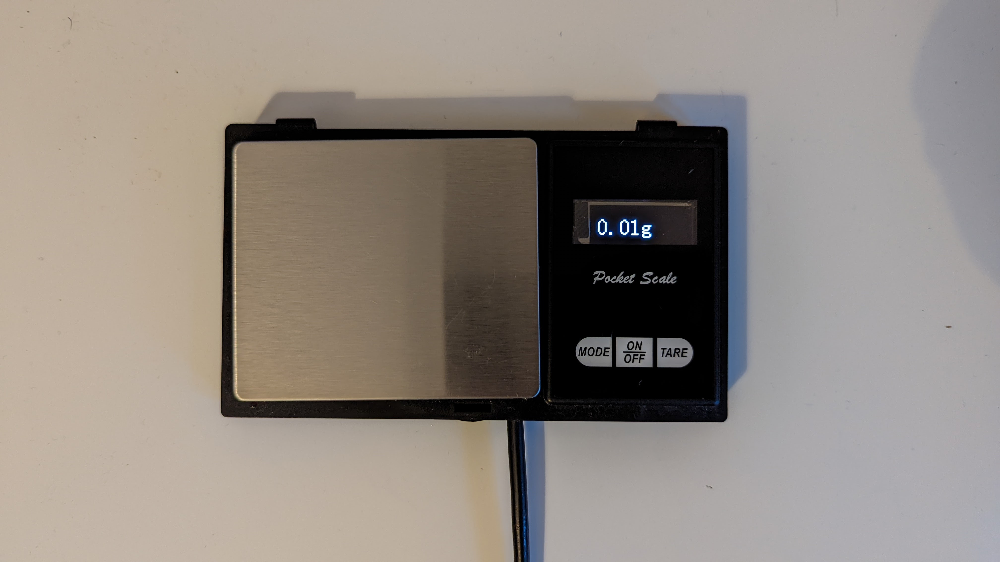
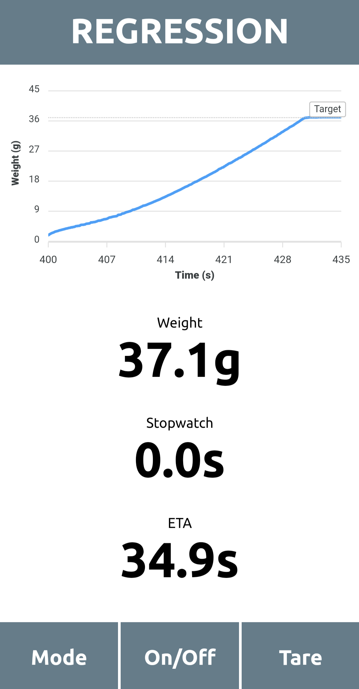

# Coffee-Scale

This repository contains the firmware for an ESP8266 or similar controlling a modified scale.

## Features

* Stopwatch
* Shot-Time estimation with adjustable target weight
* Visualization via a webapp running on the scale
* Adjustable sampling rate

## Hardware

The project currently runs on a ESP8266-12E. In general it should also run on any other ESP8266 based chip.

A HX711 Load Cell Amplifier is used to read the load cell. The display was replaced with an OLED display driven by
a SSD1306.

The 3 Buttons on the scale were also wired to the chip.

Sadly, the provided 2 AAA batteries of the scale are not sufficient as a power source. I simply use an external USB power bank. When a bigger case is available, it could also be powered by an LiIon or LiFePo Cell.

## Web GUI

The GUI contains a diagram with the latest measurements.
When in `Regression` mode, it will also display the target weight and estimated time.

